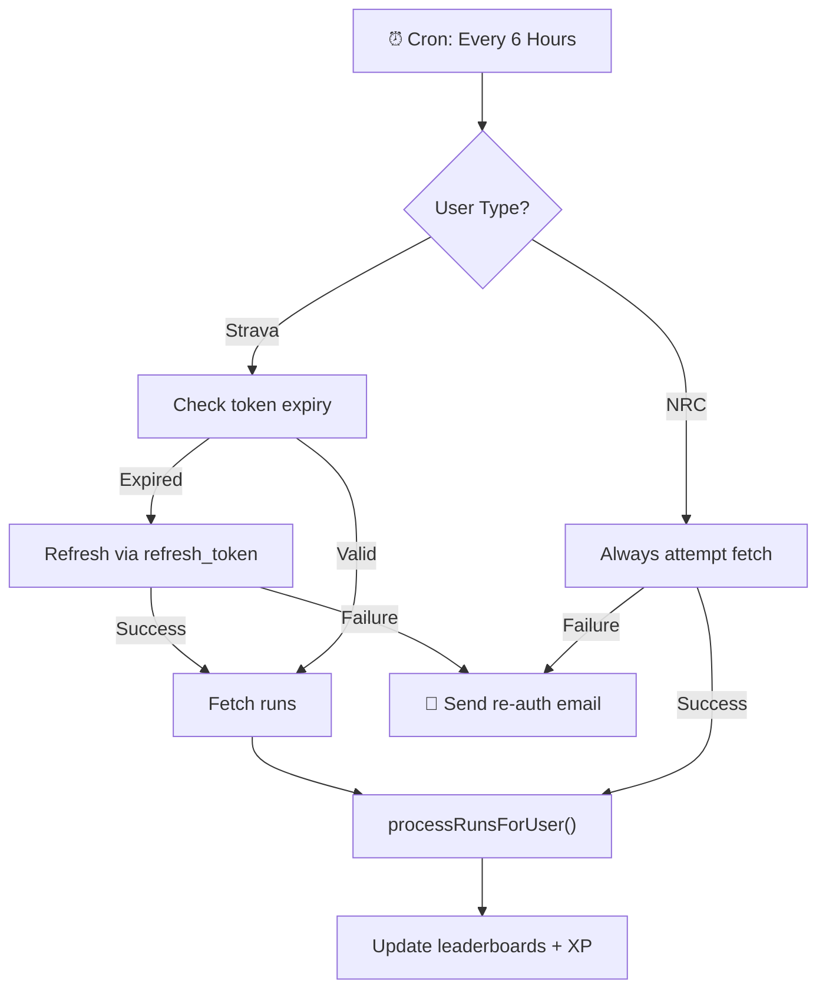

# Walkthrough: Automatic Run Fetching

## What Changed

This feature adds a cron job that automatically syncs users' runs every 6 hours, eliminating the need for manual login to update leaderboards.

### New Files

| File | Purpose |
|------|---------|
| [process-runs.ts](file:///Users/jace/Documents/Development/strive/src/backend/services/runs/process-runs.ts) | Shared scoring logic (extracted from runs route) |
| [sync-runs.ts](file:///Users/jace/Documents/Development/strive/src/backend/cron/sync-runs.ts) | **Core cron job** — runs every 6 hours |
| [ReAuthNotification.tsx](file:///Users/jace/Documents/Development/strive/src/backend/services/email/templates/ReAuthNotification.tsx) | Re-auth email template |
| [trigger-sync-runs/route.ts](file:///Users/jace/Documents/Development/strive/src/app/api/webhooks/cron/trigger-sync-runs/route.ts) | Manual webhook trigger |

### Modified Files

| File | Change |
|------|--------|
| [schema.prisma](file:///Users/jace/Documents/Development/strive/prisma/schema.prisma) | Added `refresh_token`, `token_expires_at`, `lastSyncAt` to User |
| [auth/index.ts](file:///Users/jace/Documents/Development/strive/src/backend/services/auth/index.ts) | [findOrCreateUser](file:///Users/jace/Documents/Development/strive/src/backend/services/auth/index.ts#7-88) accepts+stores refresh token data |
| [login/callback/route.ts](file:///Users/jace/Documents/Development/strive/src/app/api/login/callback/route.ts) | Strava callback passes refresh token to auth service |
| [runs/route.ts](file:///Users/jace/Documents/Development/strive/src/app/api/runs/route.ts) | Replaced inline scoring with [processRunsForUser()](file:///Users/jace/Documents/Development/strive/src/backend/services/runs/process-runs.ts#6-137) |
| [email/index.ts](file:///Users/jace/Documents/Development/strive/src/backend/services/email/index.ts) | Added [sendReAuthEmail()](file:///Users/jace/Documents/Development/strive/src/backend/services/email/index.ts#149-169) method |
| [instrumentation.ts](file:///Users/jace/Documents/Development/strive/src/instrumentation.ts) | Registers the new cron job |

## How It Works

## Verification

- ✅ `npx prisma generate` — Prisma client regenerated with new fields
- ✅ `npx tsc --noEmit` — TypeScript compiles cleanly (only pre-existing errors)

## Next Steps

> [!IMPORTANT]
> Run `npx prisma db push` in your deployment environment to apply the schema changes to MongoDB before deploying.

To manually test: `POST /api/webhooks/cron/trigger-sync-runs` (no auth needed in dev mode).
